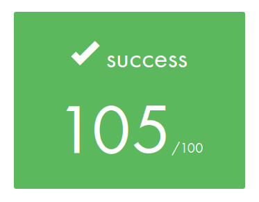

# cub3D

### Score

<div style="text-align: center;">
	
	<p> 2024/12/30 </p>
</div>


### How to use
```sh
git clone git@github.com:1RO8s/cub3D.git
cd cub3d
make
./cub3D map/test.map
```

### Usefull alias
```
# set alias command
source config/alias.zsh

# execute './cub3D map/test.cub'
run
```


### How to use Tester
```
# current directory is PROJECT_DIR/cub3d
git clone git@github.com:kamitsui/cub3D_parse_test.git
cd test

# parse check
./parse_check

# run with select map
./run_select_map.sh

# leak check
./leak_check.sh
```

### Example
```sh
make
```
output the below message


```sh
./cub3D map/test.map
# or
source config/alias.zsh
run
```

### Note
-> [Current Progress](docs/progress.md)

> memo : paste the completed cub3D game image here
>
> note : [image_note](docs/pdf/kamitsui_note.pdf)

### About us
* [hnagasak](https://profile.intra.42.fr/users/hnagasak) : github[1R08s](https://github.com/1RO8s)
* [kamitsui](https://profile.intra.42.fr/users/kamitsui) : github[kamitsui](https://github.com/kamitsui)

Joined the 42Tokyo in the same year (2023.1)

Start this project at 2024.8
