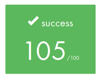
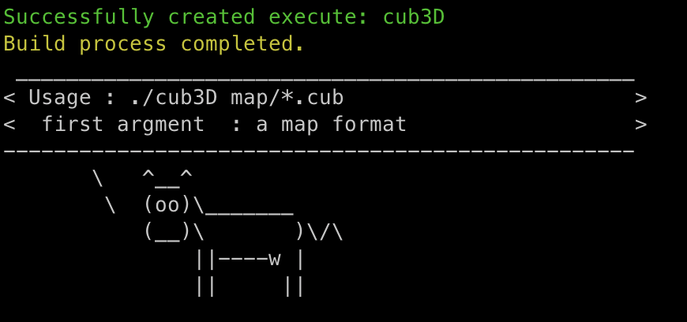

# README.md {#readme}

### Score

<!--- github ok , but doxygen ?
-->
<div align="center">
	
	<p> 2024/12/30 </p>
</div>

<!--- github ng , but doxygen ok
<div align="center">
	
</div>

<div align="center">
	2024/12/30
</div>
-->

<!--- github NG : left side

-->

<!--- github NG : not display image
<div align="center">
	
</div>
-->


### How to use
```{.sh}
git clone git@github.com:1RO8s/cub3D.git
cd cub3d
make
./cub3D map/test.map
```

### Usefull alias
```
# set alias command
source config/alias.zsh

# execute './cub3D map/test.cub'
run

# leack
make check
leak_check # or leak_check_all

# abort
make asan
run

# norminette
norm # output to norm_result.txt

# forbidden function
nm_cub # output to nm_cub.txt
nm_obj # output to nm_obj.txt

# ctags for jump function
ctags_cub3d
```


### How to use Tester
```
# current directory is PROJECT_DIR/cub3d
git clone git@github.com:kamitsui/cub3D_parse_test.git
cd test

# parse check
./parse_check

# run with select map
./run_select_map.sh

# leak check
./leak_check.sh

# output to trace/*.log
```

### Enjoy Makefile
```sh
make
```



### About us
* Intra:[hnagasak](https://profile.intra.42.fr/users/hnagasak) / GitHub:[1R08s](https://github.com/1RO8s) / [Repository](https://github.com/1RO8s/cub3D)
* Intra name : [kamitsui](https://profile.intra.42.fr/users/kamitsui) / GitHub : [kamitsui](https://github.com/kamitsui) / [Repository](https://github.com/kamitsui/cub3D)

Joined the 42Tokyo in the same year (2023.1)

Start this project at 2024.8

---
### Cub3D project documents
[document page](https://kamitsui.github.io/cub3D/)
