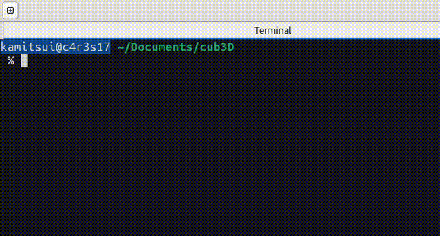

# Cub3D current progress
...

Commit ID: [309cab8](https://github.com/1RO8s/cub3D/commit/309cab8)

11/23 by kamitsui

...

---
1123 parse/cub_file

Find bug : Abort with using large map

---
1121 parse/cub_file

Find bug : segmentation fault

After

---
1017 feat/move_and_rotate

Add move_and_strafe.c rotate.c in srcs/update_utils

---
1014 bugfix/texture

Add draw_ceiling() and draw_floor()

---
1013 bugfix/texture

texture direction

---
1012 feat/texture

texture sonic

texture plank

---
1001

Nouth

West

East

South

---
0922

